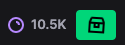

# Twitch automatic channel points / Chrome extension

  
Checks every 60 seconds if there is a chest to be claimed. If there is, clicks it for you.

## How to install
1. Download [this repository](https://github.com/thukka/twitch-automatic-points/archive/refs/heads/main.zip) and unzip it somewhere.
2. Enter `chrome://extensions/` in the address bar **or** in the top right corner select the three dots -> More tools -> Extensions.
3. Enable developer mode in the top right corner.
4. Click "Load unpacked".
5. Select the unzipped folder and you're done!

## TODO
- Make the popup window more stylish.
- Instead of showing total points accumulated across all streamers show each streamer points individually.
- Figure out if there is a better way to check for the chest button than setInterval.